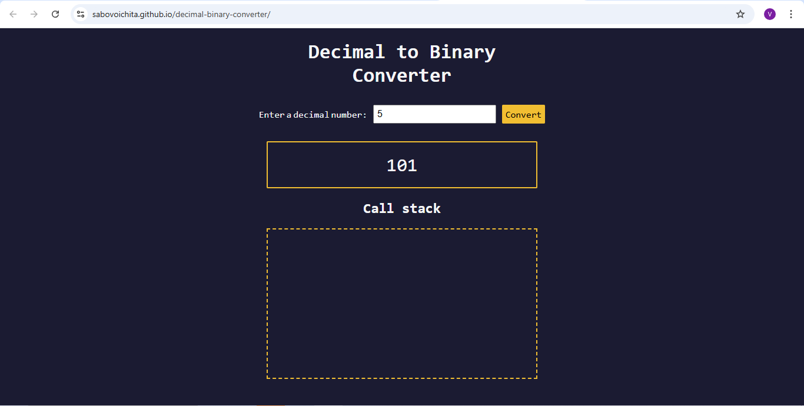

# Decimal Binary Converter

In this project, you’ll build a decimal-to-binary converter using JavaScript. You’ll learn the fundamental concepts of recursion, explore the call stack, and build out a visual representation of the recursion process through an animation.

Recursion is a programming concept where a function calls itself. This can reduce a complex problem into simpler sub-problems, until they become straightforward to solve.

# [live](https://sabovoichita.github.io/decimal-binary-converter/)

